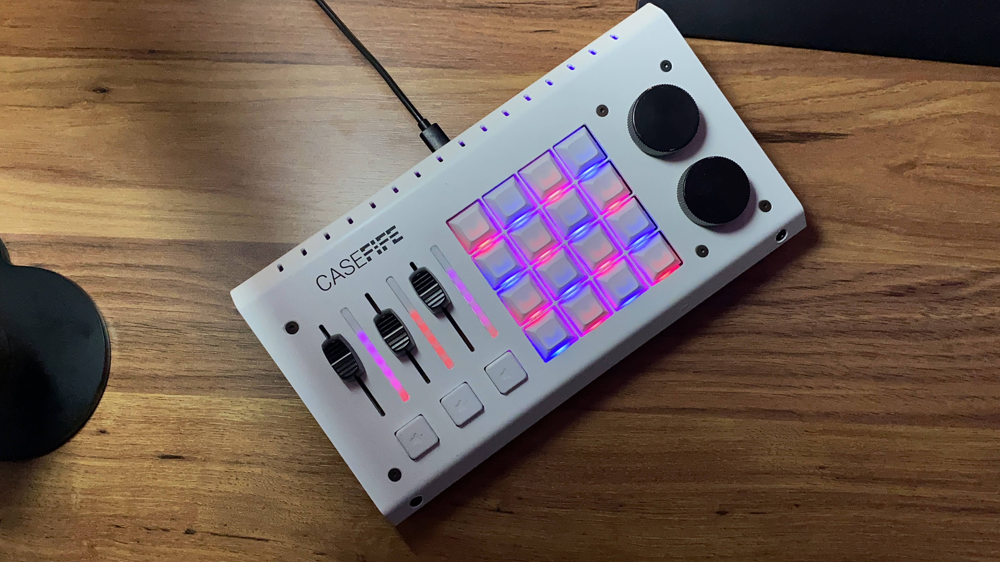
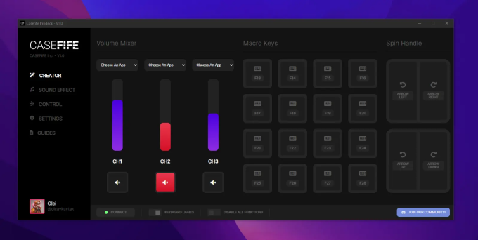

# Casefife Prodeck Desktop Software ElectronJS Project

CASEFIFE Prodeck is a customizable macro keyboard. Easily manage your live broadcasts with Prodeck. Quickly and easily control your computer's audio mixer. Gain complete mastery over your computer routines with the Prodeck device

With the Casefife desktop software, you can easily customize your Prodeck device.

Through our desktop application, which runs seamlessly on Windows, MacOS, and Linux operating systems, you can customize your CASEFIFE Prodeck device according to your usage style. You can quickly and easily assign any macro function to the physical buttons and knobs on the device based on your preferences.